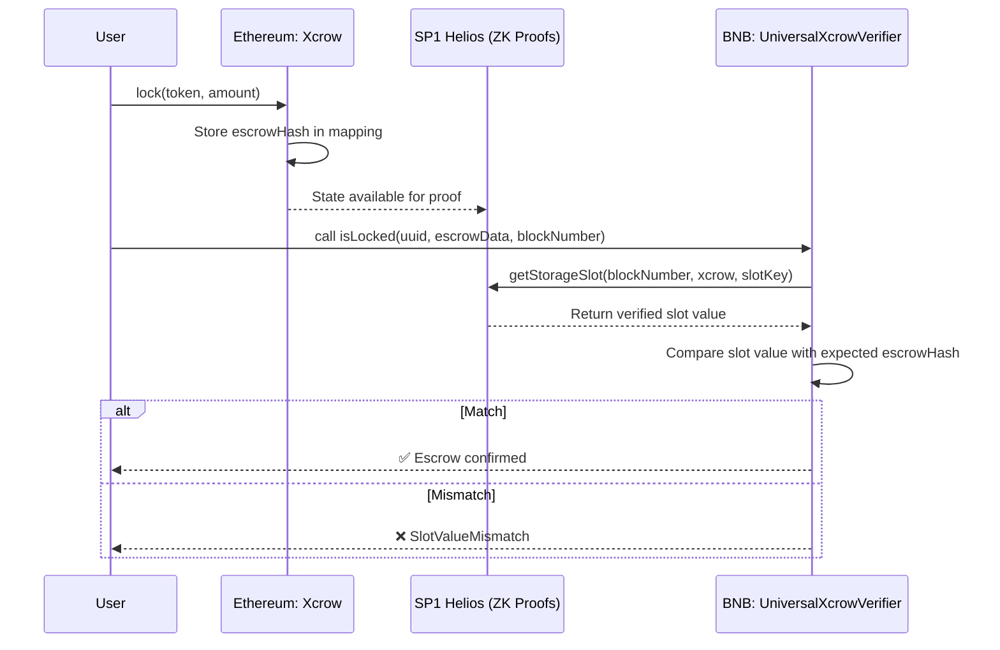

## Xcrow

**Cross-chain escrow powered by zero-knowledge proofs.**

Xcrow lets users lock tokens on Ethereum mainnet and prove those deposits on BNB Chain using [Succinct SP1 Helios](https://github.com/succinctlabs/sp1-helios). 

## ✨ What is Xcrow?

Xcrow is a simple trustless cross-chain escrow contract.
- On Ethereum, users deposit tokens into the Xcrow contract. Each escrow is recorded as a unique hash.
- On destination chain(let's say BNB Chain), anyone can verify a deposit using the UniversalXcrowVerifier, which checks Ethereum storage values against SP1 Helios proofs.

This enables secure, proof-based escrow settlement across chains — without multisigs, custom bridges, or trusted relayers.

## 🔧 How it works

### Lock on Ethereum:

A user calls lock(token, amount) on the Xcrow contract. This transfers tokens and stores a hash of the escrow data in a mapping.

### Proof on BNB Chain:

The UniversalXcrowVerifier contract queries SP1 Helios with a block number, contract address, and computed storage slot.
- If the slot value matches the expected escrow hash, the verifier confirms the deposit.
- This allows destination-chain contracts to safely act on escrowed deposits.

### Trust model:

Security comes entirely from Ethereum state + SP1 proofs, not from trusted parties.

## 🔗 Flow



## 📜 Contracts

- Xcrow.sol –- Origin escrow contract (Ethereum)
- UniversalXcrowVerifier.sol –- Destination verifier contract (e.g BNB Chain)

## Usage

### Build

```shell
$ forge build
```

### Test

```shell
$ forge test
```

### Format

```shell
$ forge fmt
```